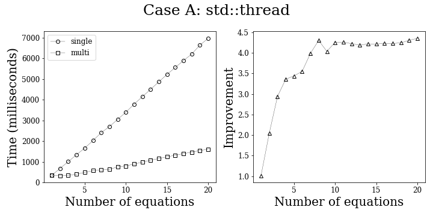

This directory holds examples of usage. The directory structure is outlined below. 
Each subdirectory has a Make file. Examples can be built by running `Make` followed
by the name of the example. For example: `./example_ad_node_scalar`.

```
|---examples
|   |---example_adnode_scalar.cpp            // Simple usage of ADNode and Value objects to derive scalar function.
    |---example_autodiffer_jacobian.cpp      // Demonstration of how to get jacobian of 3 vector functions each with 2 variables.
    |---example_autodiffer_scalar.cpp        // Simple usage of AutoDiffer on scalar function.
    |---example_autodiffer_scalar2.cpp       // More complicated scalar function with AutoDiffer.
    |---example_autodiffer_vector.cpp        // Vector function with AutoDiffer.
    |---Makefile
    |---live_demo
    |   |---example_live_demo.cpp            // Basic example used for live demo in video.
        |---Makefile
    |---multithreading
    |   |---example_multiple_functions.cpp   // Simplest multi-threaded example using std::threads to show performance improvements.
        |---Makefile
        |---benchmark
        |   |---benchmark.sh                 // Shell script to run many openmp and std thread examples. writes to data/.
            |---example_opennmp.cpp          // Openmp multithreaded example. User specifies number of threads, equations, and operations.
            |---example_std_thread.cpp       // Same as above but with std::thread.
            |---Makefile
            |---data
            |   |---openmp_case_A.txt        // Case A data for Openmp created by benchmark.sh.
                |---openmp_case_B.txt        // Case B data for Openmp created by benchmark.sh.
                |---std_case_A.txt           // Case A data for std::thread created by benchmark.sh.
                |---std_case_B.txt           // Case B data for std::thread created by benchmark.sh.
                |---data.ipynb               // Jupyter notebook to plot data.
```

## Base examples.

Each of these examples live in the top level `examples/` directory. Running `make`
in this directory will build all five of the following tests. Each can be ran with
their respective name after make finishes (e.g., `./example_autodiffer_jacobian`).
Each of these examples prints to the terminal the expected and AutoDiffer results.
Examples 1,3,4 are one scalar valued function. Example 2 is 3 functions of 2 variables.
Example 5 is one function of 2 variables.

1. `example_adnode_scalar.cpp`
2. `example_autodiffer_jacobian.cpp`
3. `example_autodiffer_scalar.cpp`
4. `example_autodiffer_scalar2.cpp`
5. `example_autodiffer_vector.cpp` 

## Multithreading examples.

### Base example.
Based on our multithreading extension, we present a number of further examples. The first is
`multithreading/example_multiple_functions.cpp`. This demonstrates the simplest multithreading
use case which is passing a vector of functions into the `DeriveStdThread` call. This example 
can be built by running `make` in `examples/multithreading`, and is run with 
`./example_multiple_functions`, which should provide an output similar to the one below:

```
Multithreaded time (microseconds): 4308
Single threaded time (microseconds): 16392
```

### Benchmark examples.
In the `examples/multithreading/benchmark/` directory, there are two more examples:

1. `example_openmp.cpp`
2. `example_std_thread.cpp`

which demonstrate the OpenMp and std::thread implementations of multithreading respectively.
These can be built by running `make` in `examples/multithreading/benchmark/`. 
Following the make, we recommend running `bash benchmark.sh` to collect data for your machine.
This will test a number of combinations of many equations and many ops per equation for both
openmp and std::thread. Noe that you will need OpenMp installed in order to run the 
benchmarking. The compiler flags will take care of the rest. The output from the benchmarking script
should look like:

```
Collecting data for std::thread Case A .................... done!
Collecting data for std::thread Case B ..................... done!
Collecting data for openmp Case A .................... done!
Collecting data for openmp Case B ..................... done!
Data written to data/ directory!
```

We collect data for two broad cases:
1. Case A: Large equations (in number of ops), but relatively few of them.
2. Case B: Small equations, but many of them.

Specifically we collect the following data:
1. Case A:
- Runtime for i in range 1, 2, ..., 20 equations, where each equation has 1500 operations.
1. Case B;
- Runtime for i in range 1, 1000, 2000, ..., 20000 equations, where each equation has 5 operations.

We collect this data for std::thread (which spins up a new thread for each equation) and
for openmp (which we default to six threads). We observe the following tradeoff between the 
multithreading options:

std::thread
1. Pros:
- Runtimes are consistently about 4x faster that single threaded version when there are relatively
few functions. 
- Outperforms openmp when there are few equations that each have a ton of operations (Case A).
- Also has the benefit of not needing a special compiler to run.
- Runtimes appear to be more consistent.

2. Cons:
- In the case where there are many functions, but each function is relatively small (Case B),
std::threads suffer. This is because a new thread is created for each function and
as a result the thread creation overhead overwhelms the performance improvement.

This is represented in the following images.




Running these examples requires command line arguments.

1. `./example_openmp num_equations num_ops num_threads`
- num_equations represents how many equations to create.
- num_ops represents how many ops per equation.
- num_threads set the open_mp number of threads used.
- `./example_openmp 100 100 5`
2. `example_std_thread.cpp`
- num_equations represents how many equations to create.
- num_ops represents how many ops per equation.
- `./example_std_thread 100 100`


See [Documentation](https://github.com/79-99/cs107-FinalProject/blob/master/docs/documentation.ipynb).